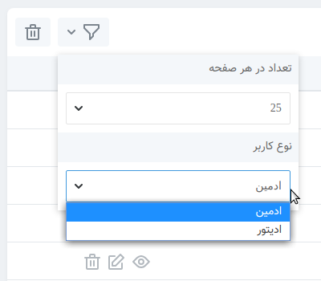
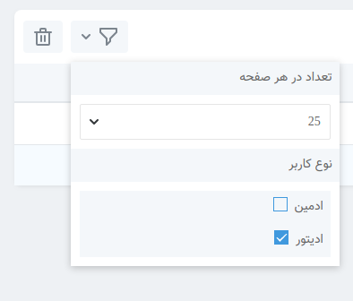
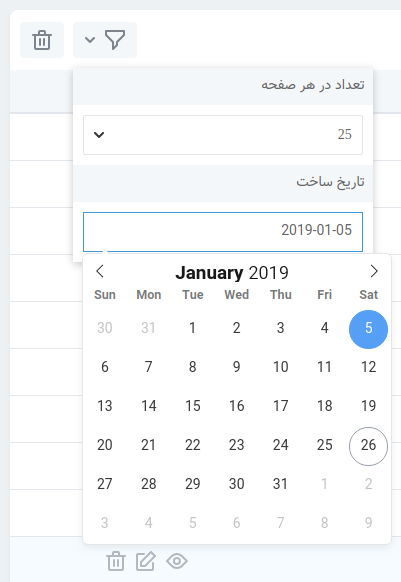

# تعریف فیلترها

[[toc]]




## فیلتر Select

پر استفاده ترین فیلتر فیلتر "select" است که به کاربر اجازه می دهد یک گزینه فیلتر را از یک منوی انتخاب کشویی انتخاب کند

روش ساخت فیلتر :

```bash
php artisan Zoroaster:filter UserType
```

حالا به مسیر `app/Zoroaster/Filters` رفته فایل فیلتر مورد نظر خود را باز کنید.

همنطور که می بینید دوتا method داره `apply` برای اعمال فیلتر `options` برای نمایش گزینه ها:

```php
<?php

    namespace App\Zoroaster\Filters;

    use Illuminate\Database\Eloquent\Builder;
    use KarimQaderi\Zoroaster\ResourceFilters\AbstractFilters\Filter;
    use KarimQaderi\Zoroaster\Traits\ResourceRequest;

    class UserType extends Filter
    {
        /**
         * نمایشی نام.
         *
         * @var string
         */
        public $label = "نوع کاربر";

        /**
         * فیلتر اعمال.
         *
         * @param Builder $query
         * @param ResourceRequest $ResourceRequest
         * @return Builder
         */
        public function apply($query , $ResourceRequest)
        {
            return $query->where('type', $this->request());
        }
        
        /**
         * فیلتر های گزینه.
         *
         * @return array
         */
        public function options()
        {
            return [
                'admin' => 'ادمین',
                'editor' => 'ادیتور',
            ];
        }
    }
```

## فیلتر Boolean

 به کاربر اجازه می دهد تا گزینه های فیلتر چندگانه را با استفاده از یک لیست چک باکس انتخاب کند.




```bash
php artisan Zoroaster:filter UserType --boolean
```


```php
<?php

    namespace App\Zoroaster\Filters;

    use Illuminate\Database\Eloquent\Builder;
    use KarimQaderi\Zoroaster\ResourceFilters\AbstractFilters\BooleanFilter;
    use KarimQaderi\Zoroaster\Traits\ResourceRequest;

    class UserType extends BooleanFilter
    {
        /**
         * نمایشی نام.
         *
         * @var string
         */
        public $label = "نوع کاربر";
        
        /**
         * فیلتر اعمال.
         *
         * @param Builder $query
         * @param ResourceRequest $ResourceRequest
         * @return Builder
         */
        public function apply($query , $ResourceRequest)
        {
            return $query->when($this->request('admin') , function($q){
                $q->orwhere('is_admin' , 'admin');
            })->when($this->request('editor') , function($q){
                $q->orwhere('is_admin' , 'editor');
            });
        }
        
        /**
         * فیلتر های گزینه.
         *
         * @return array
         */
        public function options()
        {
            return [
                'admin' => 'ادمین',
                'editor' => 'ادیتور',
            ];
        }
    }
```

## فیلتر Date

 به کاربر اجازه می دهد تا از طریق یک تقویم انتخاب تاریخ، مقدار فیلتر را انتخاب کند.



```bash
php artisan Zoroaster:filter CreatedAt --date
```


```php
<?php

    namespace App\Zoroaster\Filters;

    use Illuminate\Database\Eloquent\Builder;
    use Illuminate\Support\Carbon;
    use KarimQaderi\Zoroaster\ResourceFilters\AbstractFilters\DateFilter;
    use KarimQaderi\Zoroaster\Traits\ResourceRequest;

    class CreatedAt extends DateFilter
    {
        /**
         * نمایشی نام.
         *
         * @var string
         */
        public $label = 'تاریخ ساخت';
        
        /**
         * فیلتر اعمال.
         *
         * @param Builder $query
         * @param ResourceRequest $ResourceRequest
         * @return Builder
         */
        public function apply($query , $ResourceRequest)
        {
            $value = Carbon::parse($this->request());
            return $query->where('created_at' , '>=' , $value);
        }
    }
```
