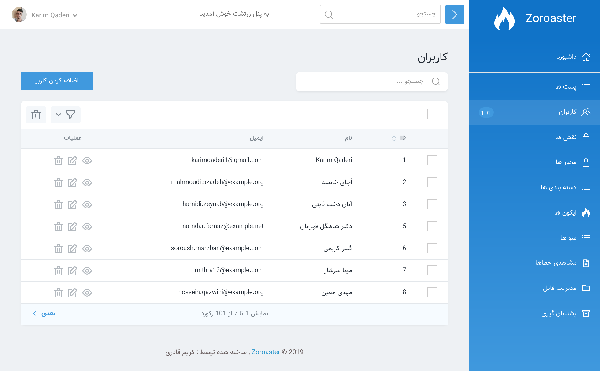

# اصول اولیه 

[[toc]]

زرتشت یک پنل ادمین هست که می توان باهاش "resource" ساخت .


## ایجاد Resource 

بصورت پیشفرض در زرتشت هر **Resource** در مسیر `app/Zoroaster/Resources` ثبت می شند.
برای ساخت **Resource** جدید کد زیر رو در **terminal** اجرا کنید .

```bash
php artisan Zoroaster:resource Post
```

اساسی ترین  ویژگی یک **Resource**، ویژگی **Model** آن است. برای مشخص کردن آن بصورت زیر اقدام کنید :


```php
/**
 * مربوطه Model نام
 *
 * @var Model
 */
public static $model = 'App\Post';
```

حالا  **Resource** ساخته شده و فقط داری فیلد `ID` هست . نگران نباشید الان به فیلد های دیگم می رسیم .


## ثبت Resources 

:::tip بصورت خودکار

به طور پیش فرض، تمام Resources موجود در پوشه `app/Zoroaster/Resources` به طور خودکار ثبت می شوند. شما لازم نیست که آنها را به صورت دستی ثبت کنید

:::

**همانطور که در بالا توضیع داده شده، شما مجبور نیستید `resources` خود را ثبت کنید؛ با این حال، اگر شما تصمیم به انجام این کار دارید بصورت زیر اقدام کنید.**

برای ثبت `resources` دو روش وجود دارد یکی بصورت پوشه  `resourcesIn` , دیگری بصورت تکی 
یا گروهی `resources`

حالا به `ServiceProvider` خود رفته ترجیحا `ZoroasterServiceProvider` باشد. و از کدای زیر استفاده کنید .

```php
use App\Zoroaster\Resources\User;
use App\Zoroaster\Resources\Post;

  Zoroaster::resourcesIn(app_path('Zoroaster/Resources'));

  Zoroaster::resources([
      User::class,
      Post::class,
  ]);
  
  // OR
  
    Zoroaster::resources(User::class);
    Zoroaster::resources(Post::class);

```

## اضافه لینک Resource به Sidebar 

وقتی `resources` خود را ثبت می کنید برای نمایش دادن آن در **Sidebar** کناری بصورت زیر اقدام کنید

اول به مسیر `app\Zoroaster\Other\Sidebar` رفته و داخل بخش `Menu` کد زیر رو قرار دهید .

```php

use KarimQaderi\Zoroaster\Sidebar\FieldMenu\MenuItem;
use App\Zoroaster\Resources\User;
use App\Zoroaster\Resources\Post;
use App\User as ModelUser;

/**
 * قسمت منوی اصلی سایت
 *
 * @return array
 */
public static function Menu()
{
    return [
        MenuItem::make()->resource(Post::class)->icon('list') ,
        MenuItem::make()->resource(User::class)->icon('users')->badge(ModelUser::count()) ,
    ];
}
```



