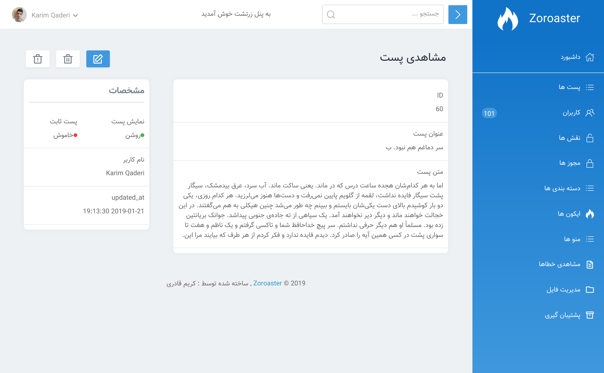
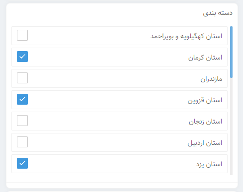

# فیلدها

[[toc]]

## تعریف فیلدها 

هر **resource** یه  method به اسم `fields`  دارد و به صورت  array هست .

برای اضافه کردن یک فیلد به **resource**، کافیه بصورت زیر اقدام کنید.


```php
use KarimQaderi\Zoroaster\Fields\ID;
use KarimQaderi\Zoroaster\Fields\Text;

/**
 *  گرفتن فیلدها برای نمایش دادها
 *
 * @return array
 */
public function fields()
{
    return [
        ID::make()->sortable(),
        Text::make('نام','name')->sortable(),
    ];
}
```

### مقادیر ستون فیلد 

وقتی یه فیلد رو می زارید باید دوتا پارامتر رو مشخص کنید.
پارامتر اول برچسب هست می توانید هر چیزی رو بزارید.
پارامتر دوم ماله نام ستونی که در داخل دیتابیس هست باید بنویسید

```php
Text::make('label', 'name_column_in_database')
```

## Showing / Hiding فیلدها 


اغلب شما فقط می خواهید فیلد را در شرایط خاص نمایش دهید. به عنوان مثال، معمولا نیازی به نشان دادن  فیلد رمز عبور در صفحه `index` نیست. 

روش های زیر برای نشان دادن / مخفی کردن فیلد ها می توانید استفاده کنید.

- `hideFromIndex`
- `hideFromDetail`
- `hideWhenCreating`
- `hideWhenUpdating`
- `onlyOnIndex`
- `onlyOnDetail`
- `onlyOnForms`
- `exceptOnForms`

می توانید بصورت زیر استفاده کنید بصورت زنجیروار.

```php
Text::make('نام','name')->hideFromIndex()
```

## مرتب کردن فیلد از نظر ظاهری 

 مرتب کردن فیلد ها در صفحه `from` و `detail`.




برای مرتب کردن فیلد ها می توانید از موارد زیر استفاده کنید.

- `Row`
- `Col`
- `Panel`
- `RowOneCol`
- `RowOneColBg`

هر کدام از انها دارای مقادیر متفاوتی هست و بصورت زیر می توانید استفاده کنید.


یک مثال ساده.

```php
use KarimQaderi\Zoroaster\Fields\Group\Panel;

/**
 *  گرفتن فیلدها برای نمایش دادها
 *
 * @return array
 */
public function fields()
{
    return [
    
       new Panel('label' , [
            ID::make()->sortable(),
       ]) ,
           
    ];
}
```

موارد دیگر و البته می توانید به صورت گروهیم ازشون استفاده کنید.

```php
use KarimQaderi\Zoroaster\Fields\Group\Col;
use KarimQaderi\Zoroaster\Fields\Group\Panel;
use KarimQaderi\Zoroaster\Fields\Group\Row;
use KarimQaderi\Zoroaster\Fields\Group\RowOneCol;
use KarimQaderi\Zoroaster\Fields\Group\RowOneColBg;

/**
 *  گرفتن فیلدها برای نمایش دادها
 *
 * @return array
 */
public function fields()
{
    return [
    
        new Row([
           // Fields
        ]),    
        
        new RowOneCol([
           // Fields
        ]),
        
        new RowOneColBg([
            // Fields
        ]),
        
        new Col('class for style css' , [
            // Fields         
        ]) ,
        
        new Panel('label' , [
            // Fields
        ]) ,
          
    ];
}
```

## فیلدهای قابل مرتب شدن  

می توانید مشخص کنید که در داخل صفحه `index` چه فیلدهای قابلیت مرتب شدن رو داشته باشن بصورت صعودی و نزولی .


```php
ID::make()->sortable()
```

## انواع فیلدها

:::tip فیلدهای  Relationship 

این قسمت از اسناد فقط زمینه های عدم ارتباط را مورد بحث قرار می دهد. برای کسب اطلاعات بیشتر در مورد زمینه ارتباطات،  [به این قسمت مراجعه کنید](/docs/1.0/resources/relationships.html).
:::

می توانید از فیلدهای زیر استفاده کنید :

- [Boolean](#فیلد-boolean)
- [Date](#فیلد-date)
- [DateTime](#فیلد-datetime)
- [File](#فیلد-file)
- [Divider](#فیلد-Divider)
- [HtmlElement](#فیلد-HtmlElement)
- [Html](#فیلد-Html)
- [ID](#فیلد-id)
- [Image](#فیلد-image)
- [Markdown](#فیلد-markdown)
- [Number](#فیلد-number)
- [Password](#فیلد-password)
- [Select](#فیلد-select)
- [Text](#فیلد-text)
- [Textarea](#فیلد-textarea)
- [Trix](#فیلد-trix)
- [PivotCheckBox](#فیلد-pivotcheckbox)


###  فیلد Boolean 

از این فیلد برای فعال یا غیرفعال مورد استفاده قرار می گیرد:

```php
use KarimQaderi\Zoroaster\Fields\Boolean;

Boolean::make('وضعیت پست','status')
```

در داخل دیتابیس بصورت `0` و `1` ذخیره می شود


###  فیلد Date 

فیلد `Date` ممکن است برای ذخیره یک مقدار تاریخ (بدون زمان) استفاده شود.

```php
use KarimQaderi\Zoroaster\Fields\Date;

Date::make('تاریخ تولد','birthday')
```

####  فرمت های Date

شما می توانید قالب نمایش داده های خود را با استفاده از روش فرمت سفارشی کنید [flatpickr.js](https://flatpickr.js.org/formatting/#date-formatting-tokens):

```php
Date::make('تاریخ تولد','birthday')->format('d m'),
```

###  فیلد DateTime

این فیلد برای ذخیره تاریخ و زمان استفاده می شه :


```php
use KarimQaderi\Zoroaster\Fields\DateTime;

DateTime::make('تاریخ آپدیت','updated_at')->hideFromIndex()
```

شما می توانید قالب نمایش داده های خود را با استفاده از روش فرمت سفارشی کنید [flatpickr.js](https://flatpickr.js.org/formatting/#date-formatting-tokens):

```php
Date::make('تاریخ ساخت','created_at')->format('d m y'),
```

###  فیلد File

برای کسب اطلاعات بیشتر در مورد تعریف زمینه فایل و بارگذاری آپلود،
[به اینجا مراجعه کنید](./file-fields.md).

```php
use KarimQaderi\Zoroaster\Fields\File;

File::make('فایل' , 'file')
```

### فیلد Divider

یه خط می سازد می توانید به عنوان جداکنند ازش استفاده کنید:

```php
use KarimQaderi\Zoroaster\Sidebar\FieldMenu\Divider;

Divider::make() 
```


### فیلد HtmlElement

برای نمایش تگ html:

```php
use KarimQaderi\Zoroaster\Fields\Group\HtmlElement;

 HtmlElement::make('h1' , 'داشبورد') ,
```
### فیلد Html

برای نمایش کد html:

```php
use KarimQaderi\Zoroaster\Fields\Group\Html;

Html::make('<b class="uk-text-danger">Test</b>'),
```


###  فیلد ID

```php
use KarimQaderi\Zoroaster\Fields\ID;

// Using the "id" column...
ID::make()

// Using the "id_column" column...
ID::make('ID', 'id_column')
```

###  فیلد Image

برای اطلاعات بیشتر
[به اینجا مراجعه کنید](#file-field):

```php
use KarimQaderi\Zoroaster\Fields\Image;

Image::make('عکس پست','photo')
```


### فیلد Markdown

```php
use KarimQaderi\Zoroaster\Fields\Markdown;

Markdown::make('متن کامنت','body')
```

###  فیلد Number

```php
use KarimQaderi\Zoroaster\Fields\Number;

Number::make('قیمت','price')
```

###  فیلد Password

```php
use KarimQaderi\Zoroaster\Fields\Password;

Password::make('رمز عبور','password')
```

###  فیلد Select

```php
use KarimQaderi\Zoroaster\Fields\Select;

Select::make('اندازه','size')->options([
    'S' => 'Small',
    'M' => 'Medium',
    'L' => 'Large',
])
```


###  فیلد Text

```php
use KarimQaderi\Zoroaster\Fields\Text;

Text::make('عنوان پست','title')
```


###  فیلد Textarea

```php
use KarimQaderi\Zoroaster\Fields\Textarea;

Textarea::make('متن کامنت','body')
```


###  فیلد Trix

[Trix editor](https://github.com/basecamp/trix) :

```php
use KarimQaderi\Zoroaster\Fields\Trix;

Trix::make('متن پست','body')
```


### فیلد PivotCheckBox

```php
PivotCheckBox::make('دسته بندی' , 'Categorie')
                                    ->show('App\\Models\\Categorie' , 'title' , 'id')
                                    ->pivot('App\\Models\\CategoriePivot' , 'post_id' , 'categorie_id');
```

**خط اول**

| نام دلخواه | نام دلخواه به انگلیسی |
| ------ | ------ |
| دسته بندی | Categorie |

<br><br>

**خط دوم show**

اطلاعات جدولی که قرار نشون داده بشه

| ادرس Model | ستونی که قرار نشون داده بشه | ایدی اصلی جدول
| ------ | ------ | ------ |
| App\\Models\\Categorie | title | id

<br><br>

**خط سوم pivot**

جدولی که داده ها در اون ذخیره می شود

| ادرس Model | نام کلید خارجی مربوط به Resource | کلید خارجی مربوط به خط دوم show
| ------ | ------ | ------ |
| App\\Models\\CategoriePivot | post_id | categorie_id


<br>




## سفارشی سازی

:::tip  دسترسی به Model Attribute 
با استفاده از `this$`  می توانید به model و relationships ها دسترسی داشته باشید.
:::


### فیلد راهنما
اگر می خواهید متن «کمک» را در زیر یک فیلد قرار دهید،از این روش استفاده کنید:

```php
Text::make('مالیان','tax_rate')->help(
    'نرخ مالیات برای فروش اعمال می شود'
);
```

شما همچنین می توانید در هنگام تعریف متن کمک خود از HTML استفاده کنید:

```php
Text::make('نام','first_name')->help(
 '<a href="#">External Link</a>'
);

Text::make('نام خانوادگی','last_name')->help(
    view('partials.help-text', ['name' => $this->name])->render()
);
``` 

### displayUsing

اگر می خواهید یک فیلد را فقط زمانی که روی صفحه  «index» یا «detail» نمایش داده می شود سفارشی کنید،از این روش استفاده کنید:

```php
Text::make('نام','name')->displayUsing(function () {
    return strtoupper($this->name);
})
```
