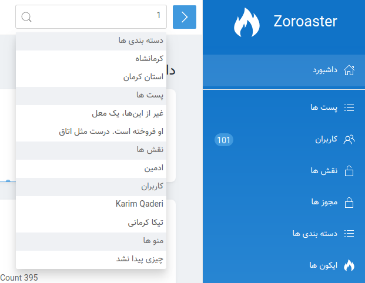

# جستجوی سراسری

[[toc]]

زرتشت نه تنها به شما اجازه می دهد تا در `resources` و روابط خاص جستجو کنید، شما همچنین ممکن است در سراسر `resources` خود را با استفاده از ورودی جستجوی سراسری در نوار بالای صفحه پانل مدیریت زرتشت جستجو کنید:




### ستون های قابل جستجو

برای تعیین اینکه چه فیلدهای `resource` قابل جستجو باشند، می توانید آرایه ای از ستون های پایگاه داده بنویسید. به طور پیش فرض شامل ستون 
`id` است، اما شما می توانید آن را با توجه به نیاز خود سفارشی کنید:


```php
/**
 * فیلد های قابل جستحو
 *
 * @var array
 */
public $search = [
    'id', 'title'
];
```


### Title

هنگامی که یک `resource` در نتایج جستجو نمایش داده می شود، نتایج عنوان `resource` را نمایش استفاده می کند :

```php
/**
 * نام فیلد پیشفرض برای نمایش دادن
 *
 * @var string
 */
public $title = 'name';
```


### غیرفعال کردن جستجوی سراسری

به طور پیش فرض، تمام `resources` زرتشت در سراسری قابل جستجو هستند؛ با این حال، شما می توانید یک `resource` داده شده را از جستجوی سراسری حذف کنید :

```php
/**
 *فعال یا غیر فعال کردن جستجوی سراسری 
 *
 * @var bool
 */
public $globallySearchable = false;
```
